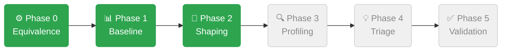

<div align="center">

# SGLang vs vLLM — Latency Profiling

<p>
  <a href="https://github.com/sgl-project/sglang">
    
  </a>
  &nbsp;
  <a href="https://github.com/vllm-project/vllm">
    
  </a>
</p>

Structured, phase-gated profiling of SGLang against vLLM on **Qwen3-VL-8B-Instruct** to extract actionable optimization targets — not a benchmark report.

*Single H200 · TP=1 · bfloat16 · text-only path*

</div>

---

## Key Findings

- **TTFT is the only gap.** TPOT and throughput are at parity (±2%) across all tested workloads.
- **SGLang carries a ~56 ms fixed scheduler/dispatch overhead at c=1.** Prompt length barely moves it — 128→2048 tokens adds just +7.7 ms. vLLM's verified floor is ~14 ms.
- **The floor is structural, not configurational.** Four scheduler flags (`--disable-overlap-schedule`, `--schedule-policy fcfs`, `--stream-interval`, `--chunked-prefill-size`) each moved TTFT by ≤2 ms.
- **Secondary finding.** When chunked prefill is actually triggered (chunk_size < prompt_len), TTFT scales linearly with chunk count — each chunk adds ~65–85 ms — suggesting the dispatch floor is incurred *per chunk*, not per request.
- **vLLM baselines revised by extended warmup.** Phase-1 measured vLLM Case C at 164 ms (warmup=30, insufficient for c=16). Stable recheck gives **181 ms**, correcting the SGLang/vLLM ratio from 1.49× → **1.33×**. vLLM Case B is bimodal — all Case B vLLM comparisons carry confidence ceiling M.

---

## Experiment Pipeline



<br>

<table>
<tr>
  <th width="120">Phase</th>
  <th width="80" align="center">Status</th>
  <th>Goal</th>
  <th>Key Output</th>
</tr>
<tr>
  <td><b>0 — Equivalence</b></td>
  <td align="center">✅</td>
  <td>Verify both frameworks load the same weights and produce equivalent outputs before any benchmarking</td>
  <td>Byte-identical greedy outputs confirmed · attention backend delta logged</td>
</tr>
<tr>
  <td><b>1 — Baseline</b></td>
  <td align="center">✅</td>
  <td>Establish a clean 4-case head-to-head table under controlled, fair conditions</td>
  <td>TTFT 3.89× / 2.59× / 1.49× / 1.34× · TPOT at parity across all cases</td>
</tr>
<tr>
  <td><b>2 — Shaping</b></td>
  <td align="center">✅</td>
  <td>Determine whether gaps are structural or configurational; select cases for profiling</td>
  <td>Cases A, B, C promoted · Case D dropped (bimodal variance) · floor confirmed structural</td>
</tr>
<tr>
  <td><b>3 — Profiling</b></td>
  <td align="center">⬜</td>
  <td>Collect SGLang mapping+formal traces and vLLM comparison traces for each selected case</td>
  <td>Torch profiler traces per case (EXTEND + DECODE stages separated)</td>
</tr>
<tr>
  <td><b>4 — Triage</b></td>
  <td align="center">⬜</td>
  <td>Interpret traces into ranked, evidence-backed hypotheses with vLLM cross-validation</td>
  <td>Kernel triage tables · category breakdown · structured hypotheses</td>
</tr>
<tr>
  <td><b>5 — Validation</b></td>
  <td align="center">⬜</td>
  <td>Confirm top hypotheses with flag-level sweeps before any PR is written</td>
  <td>Validated recommendations concrete enough for a direct PR</td>
</tr>
</table>

> Each phase is a hard gate — a phase only runs on cases and data that survived the previous one. Full decision rules in [`plan.md`](plan.md).

---

## Baseline Results (Phase 1)

> 24 runs · 4 cases × 2 frameworks × 3 reps · H200 clocked at 1980 MHz

| Case | Prompt → Output | Concurrency | SGLang TTFT p50 | vLLM TTFT p50 | Ratio | TPOT |
|:-----|:---------------|:-----------:|----------------:|---------------:|------:|-----:|
| A — Short | 128 → 128 | 1 | 54.6 ms | 14.1 ms | **3.89×** | 1.00× |
| B — Long prefill | 2048 → 128 | 1 | 62.3 ms | ~24 ms ⚠ | **~2.59×** | 0.99× |
| C — Batched | 512 → 128 | 16 | 243.9 ms | 164.1 ms | **1.49×** | 0.98× |
| D — Decode-heavy | 512 → 512 | 16 | 247.0 ms | 184.8 ms | **1.34×** | 1.02× |

> Phase-1 numbers. Case A→B spans 16× more tokens yet TTFT grows only 7.7 ms — prefill compute is cheap.
> ⚠ vLLM Case B was bimodal in Phase-1 (cv=99.3%). Phase-2 recheck confirmed bimodal behavior — comparisons carry **confidence ceiling M**.

---

## Shaping Results (Phase 2)

### Case A — scheduler-overhead sweep

Can any scheduler flag compress the ~56 ms floor?

| Flag | TTFT p50 | Δ |
|:-----|--------:|--:|
| *(default — baseline)* | 57.1 ms | — |
| `--disable-overlap-schedule` | 55.4 ms | −1.7 ms |
| `--schedule-policy fcfs` | 57.5 ms | +0.4 ms |
| `--stream-interval 8` | 57.0 ms | −0.0 ms |

**→ Structural.** 3-rep reconfirm: 56.0 ms, CV = 0.1%.

### Case B — chunked-prefill sweep

Does chunked-prefill explain the gap?

| chunk-size | Chunks | TTFT p50 | Δ vs default |
|:----------:|:------:|--------:|-------------:|
| 8192 *(default)* | 1 | 68.5 ms | — |
| −1 *(disabled)* | — | 66.7 ms | −1.8 ms |
| 1024 | 2 | 169.2 ms | +100.7 ms |
| 512 | 4 | 261.5 ms | +193.0 ms |

**→ Same structural floor.** Default chunk=8192 never splits a 2048-tok prompt. When chunking is active, TTFT ∝ chunk count — the floor is paid *per chunk*.

### Cases C & D — variance gate

Can extended warmup reduce TTFT variance to a profilable level?

| Case | warmup=30 | warmup=100 | warmup=300 | Decision |
|:-----|:---------:|:----------:|:----------:|:--------:|
| C — 512→128, c=16 | CV 9.5% | **CV 4.2%** | CV 2.1% | ✅ Promote |
| D — 512→512, c=16 | CV 19.8% | CV 0.1% † | CV 14.8% | ❌ Drop |

<sup>† 3-rep lucky window — V2 (5 reps) re-exposed a bimodal pattern: periodic ~160 ms outliers vs ~243 ms steady state.</sup>

### vLLM baseline recheck (Step 2.4)

Phase-1 vLLM baselines re-measured with warmup=300, 5 reps to validate promoted cases.

| Case | Phase-1 vLLM | Recheck vLLM | Across-rep CV | Verdict |
|:-----|:------------:|:------------:|:-------------:|:-------:|
| B (2048→128, c=1) | 24.1 ms | ~24 ms (bimodal ⚠) | **76.0%** | ⚠ **Ceiling M** |
| C (512→128, c=16) | 164.1 ms | **180.9 ms** | 5.5% | ✅ Clean |

> Phase-1 vLLM Case C was underestimated — warmup=30 insufficient for c=16. True stable baseline: **180.9 ms**. Ratio corrected: 1.49× → **1.33×**.

### Phase 3 shortlist

| Case | Priority | Phenomenon | SGLang TTFT | vLLM TTFT | Ratio | vLLM ceiling |
|:-----|:--------:|:-----------|------------:|----------:|------:|:------------:|
| **A** | Primary | ~56 ms structural dispatch floor at c=1 | 56.0 ms | 14.1 ms | **4.0×** | None |
| **B** | Primary | Same floor; per-chunk overhead when chunking active | 64.4 ms | ~24 ms ⚠ | **~2.7×** | **M** |
| **C** | Secondary | 1.33× TTFT gap at c=16, variance stable | 241 ms | 180.9 ms | **1.33×** | None |
| D | Dropped | Bimodal TTFT under sustained decode load | — | — | — | — |

---

## Environment

| | SGLang | vLLM |
|:--|:-------|:-----|
| Version | `0.0.0.dev1+ga4cf2ea12` | `0.19.0` |
| PyTorch | 2.9.1+cu129 | 2.10.0+cu128 |
| Attention (text) | FlashInfer 0.6.7.post3 | FlashAttention v3 |
| KV cache | ~102 GB | ~105.9 GB |
| GPU | H200 index 6, 144 GB | ← same |
| Model | Qwen3-VL-8B-Instruct @ [`0c351dd`](https://huggingface.co/Qwen/Qwen3-VL-8B-Instruct) | ← same |

**Functional equivalence verified:** byte-identical greedy outputs on 3 test prompts (128 tokens, temperature=0).

> ⚠️ Attention backends differ (FlashInfer vs FlashAttention v3). Any Phase-4 attention-kernel finding carries confidence ceiling **M** until a version-matched re-run with aligned backends is done.

---

## Reproducing

### Requirements

```
GPU:    Single H200 (80 GB+ for Qwen3-VL KV cache)
SGLang: dev install at /sgl-workspace/sglang
vLLM:   0.19.0 in conda env `vllm`
Model:  Qwen/Qwen3-VL-8B-Instruct (HF cache, offline)
```

### ⚠️ Dataset generation — read before running

`sglang.auto_benchmark convert --kind random` samples the full vocabulary, including Qwen3-VL multimodal special tokens (`<|image_pad|>` ID 151655, `<|vision_start|>` 151652, etc.). These trigger the vision embedding path and cause OOM. **Use the custom generator instead:**

```bash
HF_HUB_OFFLINE=1 python3 experiments/phase1/scripts/gen_datasets.py
# Restricts sampling to token IDs 0–151642
# Outputs → datasets/case{A,B,C,D}.jsonl
```

### Running the experiments

```bash
# Phase 1 — baseline (24 runs, ~6 h total)
CUDA_VISIBLE_DEVICES=6 python3 experiments/phase1/scripts/run_phase1.py

# Phase 2 — shaping sweeps (run sequentially)
CUDA_VISIBLE_DEVICES=6 python3 experiments/phase2/scripts/run_phase2_caseA.py    # ~2 h
CUDA_VISIBLE_DEVICES=6 python3 experiments/phase2/scripts/run_phase2_caseB.py    # ~1.5 h
CUDA_VISIBLE_DEVICES=6 python3 experiments/phase2/scripts/run_phase2_caseCD.py   # ~2 h
```

---

## Repository Layout

```
profiling_lab/
├── plan.md                          ← Master document: execution plan, decisions, all results
│
├── datasets/                        ← Canonical autobench JSONL — never regenerate mid-project
│
├── experiments/
│   ├── env_snapshot.md              ← Framework versions, attention backends, GPU memory
│   ├── phase0/equivalence.md        ← Tier A/B/C equivalence matrix and greedy output comparison
│   ├── phase1/                      ← Raw bench_serving JSON per (case × framework × rep)
│   ├── phase2/selected_cases.md     ← Phase-3 entry gate with per-case verdicts
│   └── phase2_shaping/              ← Per-case sweep raw results and summary tables
│
├── logs/                            ← Server stderr · kernel-API boundary trails (L1 passive)
├── traces/                          ← Torch profiler artifacts — Phase 3, pending
├── analysis/                        ← Triage tables · hypotheses · recommendations — Phase 4, pending
└── reports/                         ← Final deliverables — Phase 5, pending
```

---

<div align="center">
<sub>👤 Bowen Wang &nbsp;·&nbsp; 🐳 sglang-bowenw</sub>
</div>
