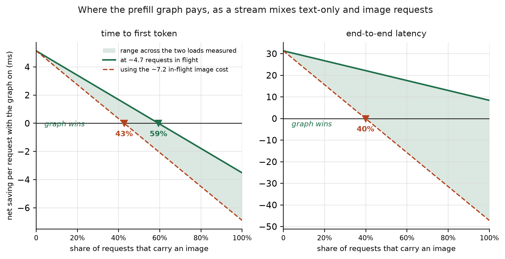
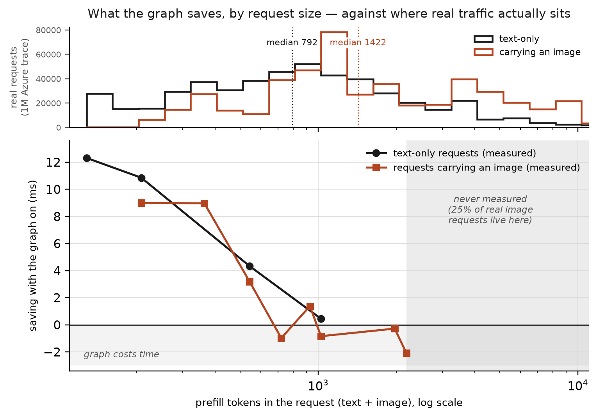

# Is "5–20% of requests carry an image" a defensible assumption?

**No. I invented that range**, and this note records what replaced it.

The original framing came from the owner and was qualitative — "people don't
attach an image all the time, they attach one once in a while". I converted that
into `f ≈ 0.05–0.2` and then used it throughout the Q2 analysis, the report and
the PDF summary. Nothing supported the numbers.

## What the public evidence actually says

**There is no published figure for the natural image share of LLM traffic, and
the question as posed has no single answer.**

The best available production data is Microsoft's
[Azure LMM Inference Dataset 2025](https://github.com/Azure/AzurePublicDataset/blob/master/AzureLMMInferenceDataset2025.md):
one week (2024-10-15 → 22) from a real Azure multimodal inference cluster, 1 000 000
requests, with `NumImages` per request. Downloaded and analysed here.

**Its modality mix cannot be used**, because it is balanced by construction:

```
total requests           1,000,000
requests with >=1 image    500,000   -> 50.00%
text-only                  500,000   -> 50.00%
```

Exactly 500 000 of each, to six significant figures, is not a natural ratio. The
hourly share does swing from 16.3% to 77.8% (median 49.1%), so there is genuine
temporal structure inside each class — but the global 50/50 is a sampling
artifact and the hourly figures are ratios of two independently normalised
samples, so neither answers the question.

The accompanying paper
([ModServe / *Towards Efficient Large Multimodal Model Serving*](https://arxiv.org/html/2502.00937v1))
does not state the cluster's true mix either. What it does say is more useful:
the cluster serves **"two different categories of services, image-heavy and
text-heavy"**, and the two behave oppositely — image-heavy services show up to 5×
higher prompt-token rates for image-text requests, text-heavy services 3× higher
for text-only.

**So the image fraction is a property of the deployment, not of "LLM traffic".**
Asserting any single number for it — mine included — is the wrong shape of claim.

Checked and found nothing usable: WildChat-1M and LMSYS-Chat-1M (text-only
corpora, no image share reported), and published OpenAI/Anthropic usage material
(no modality breakdown).

## What the trace *can* answer, and it matters more

The modality mix is synthetic; the **prompt-size distribution is real**. And our
own Q1 result is that the prefill graph's benefit is governed by prefill token
count. So the trace can be mapped directly onto our measured curve.

| ContextTokens (text + image) | p10 | p25 | **p50** | p75 | p90 |
|---|---|---|---|---|---|
| text-only | 176 | 370 | **792** | 1471 | 3151 |
| with image | 435 | 882 | **1422** | 4049 | 9703 |

Against the regimes we measured (material win ≤364 tokens, marginal to 544,
nothing resolvable above):

| | ≤364 tok | 365–544 | **>544** |
|---|---|---|---|
| text-only | 24.5% | 12.0% | **63.5%** |
| with image | 5.8% | 7.1% | **87.2%** |
| all | 15.2% | 9.5% | **75.3%** |

**Only 15.2% of real requests fall where we measured a material win; 75.3% sit
above it.** Our Q2 text prompts were 512 tokens — between the p25 and p50 of real
text traffic, i.e. **smaller than typical**. The benchmark was not wrong, but it
was not representative either, and the recommendation drawn from it was
correspondingly optimistic.

## Re-weighting our own result by the real size distribution

Interpolating our measured saving curves (Q1 text-only; IMG-R for image requests)
over every request in the trace, holding the curve flat beyond the largest size
we measured:

| class | mean saving | median | share gaining > 0.5 ms |
|---|---|---|---|
| text-only | **+3.96 ms** | +2.33 ms | 61.1% |
| with image | **+0.07 ms** | −0.77 ms | 21.9% |
| all (at the trace's 50/50 mix) | **+2.02 ms** | +0.45 ms | 41.5% |

Against the **+4.0 to +4.5 ms** the earlier report quoted for "f ≈ 0.05–0.2".
The direction survives; the magnitude was roughly double what a realistic size
distribution supports.

**Caveats that limit this re-weighting**, none of them small:

1. Our curve is concurrency 1; Q2 found similar effects at ~4.7 in flight, but
   the mapping is not validated at load.
2. **The tail is extrapolated.** We measured up to 2184 tokens; 25% of real image
   requests exceed 4049. Those are held flat at the last measured value.
3. The trace is a different model on different hardware. Token counts are a
   property of the workload and transfer reasonably; latencies do not, which is
   why only the *size distribution* is borrowed.
4. The "all" row uses the trace's synthetic 50/50 mix and is therefore not a
   production-weighted number either. It is shown to bracket, not to claim.

## What replaces the recommendation

Not "at 5–20% images, enable it" — a claim about a mix nobody has measured — but
two curves, and the reader's own workload placed on them.

**Where the graph pays as a stream mixes the two request types:**



**What it saves by request size, against where real traffic actually sits:**



The top panel of the second figure is the million-request trace; the bottom is
this study's measurements. The gap between them is the point — **the measured
win lives to the left of where most real requests are**.

Both the size distribution and the image share are properties of a deployment.
This study can supply the curves; it cannot supply the operating point, and the
earlier attempt to do so was the error this note records.
